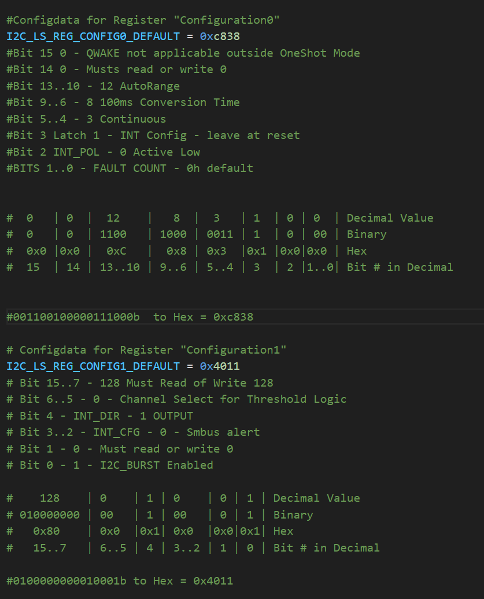

# Python I2C Userspace Drivers in Linux for Dummies

## Before we do any code...
It's important we understand how the device we want to talk to is laid out.

We know it talks I2C, which is great, but how are the bits inside organized?

This is where the Datasheet, and more importantly, the Datasheet Register Map Come in

Link to the OPT4048 [Datasheet](https://www.ti.com/lit/ds/symlink/opt4048.pdf). 


## First - Let's make sure our system is  up to date

```bash
sudo apt-get update
sudo apt-get full-upgrade -y
```

### Let's get  the I2C/SMbus Python Module

```bash
sudo pip install smbus
```

### Let's create a file for our Driver

We'll call it OPT4048.py

```bash
touch opt4048.py
i2cdetect -r 3 
```


Let's read the device ID to confirm we are looking at the right device


```bash
i2cget -y 3 0x44 0x11
```

Should return 0x08 - this is returning DIDL which is 8h in reset aka 0x08 Hex.

What's useful when trying to initialize a new device is to check if the "default" or "reset" registers are what you'd expect.

In this case, 0x11 should have been 0x08, we can also sanity check by reading another non-zero on reset register, such as Regiter 0B, which shuold return 0x80 
```bash
i2cget -y 3 0x44 0x0B
Answer: 0x80
```
## Now let's create a program to actually test our driver.

We'll call it test.py

First, let's import libraries

import os  #Useful for any OS type tasks, may be unused
import time #Required for creating delays may be unused
import smbus #Required for I2C communication

### Now let's define our constants

We do this by looking at the register map in the datasheet and writing their start and end adresses
Note there are many ways of doing this, I'm chosing the simplest way

### Now let's define some default sane config values

This is where some knowledge of binary, hex and a table comes in as we will set each bit one by one and then send the correspnding data in hex over I2C to configure the device.


Which Translates to...



We'll run a sanity check program:

```python
print("Device ID - " + hex(opt.read_device_id())) #Should read 0x821 as per datasheet

print("Default Result 0 - " + hex(opt.read_register_16bit(0x00))) #Let's make sure we read a zero here

print("Initializing Device - ")

opt.write_config_reg0()
opt.write_config_reg1()

time.sleep(1) #Give it time to settle

while True:

    print("Init Result 0 - " + hex(opt.read_register_16bit(0x00))) #Now it should read non-zero
    print("Init Counter 0 - " + hex(opt.read_register_16bit(0x01))) #Now it should read non-zero
    time.sleep(1)
```

Now we should see the result vary a little bit (as long as the device is static), but I also added a print line for a second register, namely 0x01. 

Looking at the datasheet, we see this includes a few fields which help account for some of the randomness we see printing in that line, namely RESULT_LSB_CH0, COUNTER_CH0 and CRC_CH0

So really we're dealing with a 32bit integer made from 2 16 bit registers that are formatted as such:

```EXPONENT[4] RESULT_MSB[12] REUSLT_LSB [8]  COUNTER [4] CRC [4]```

### Let's Learn some Bitwise Math to see if we can split those out:


```python
    #EXPONENT[4] RESULT_MSB[12] RESULT_LSB [8]  COUNTER [4] CRC [4]

    data = opt.read_register_16bit(0x00)
    exponent = (data >> 12) #Shift bits 12 to the right to get EXPONENT[4]
    result_msb = data & 0xFFF #Get RESULT_MSB [12] by &ing with FFF

    data = opt.read_register_16bit(0x01)
    result_lsb = (data >> 8) #RESULT_LSB
    counter = (data & 0xFF) >> 4
    crc = data & 0xFFF


    print(hex(result_msb))
```

Ok cool and all, but how do we know if what we are reading is correct?

### ENTER CRC!

-- TODO - ADD SECTION ON Calculating CRC and veryfing answers...


#Let's now get some meaningful data out

Let's look at page 17 on calculating Lux

```python
    #EXPONENT[4] RESULT_MSB[12] RESULT_LSB [8]  COUNTER [4] CRC [4]

    data = opt.read_register_16bit(0x00)
    exponent = (data >> 12) #Shift bits 12 to the right to get EXPONENT[4]
    result_msb = data & 0xFFF #Get RESULT_MSB [12] by &ing with FFF

    data = opt.read_register_16bit(0x01)
    result_lsb = (data >> 8) #RESULT_LSB
    counter = (data & 0xFF) >> 4
    crc = data & 0xFFF

    mantissa = (result_msb<<8) + result_lsb
    adc_codes = mantissa << exponent 


    print(hex(adc_codes))
``` 

### Let's make it a bit more generic so we  can read all 3 channels of data:

```python
def get_ADC_codes(self, I2C_LS_REG_EXPONENT0):
        data = self.read_register_16bit(I2C_LS_REG_EXPONENT0)
        exponent = (data >> 12) #Shift bits 12 to the right to get EXPONENT[4]
        result_msb = data & 0xFFF #Get RESULT_MSB [12] by &ing with FFF

        data = self.read_register_16bit(I2C_LS_REG_EXPONENT0 + 1)
        result_lsb = (data >> 8) #RESULT_LSB
        counter = (data & 0xFF) >> 4
        crc = data & 0xFFF

        mantissa = (result_msb<<8) + result_lsb
        adc_codes = mantissa << exponent 
        return adc_codes
```


From the Main Function we can now call:  

```python
print("Red - ", hex(opt.get_ADC_codes(0x00)), " - Green -", hex(opt.get_ADC_codes(0x02)), " - Blue -", hex(opt.get_ADC_codes(0x04)))
```
     

Now we need numpy

